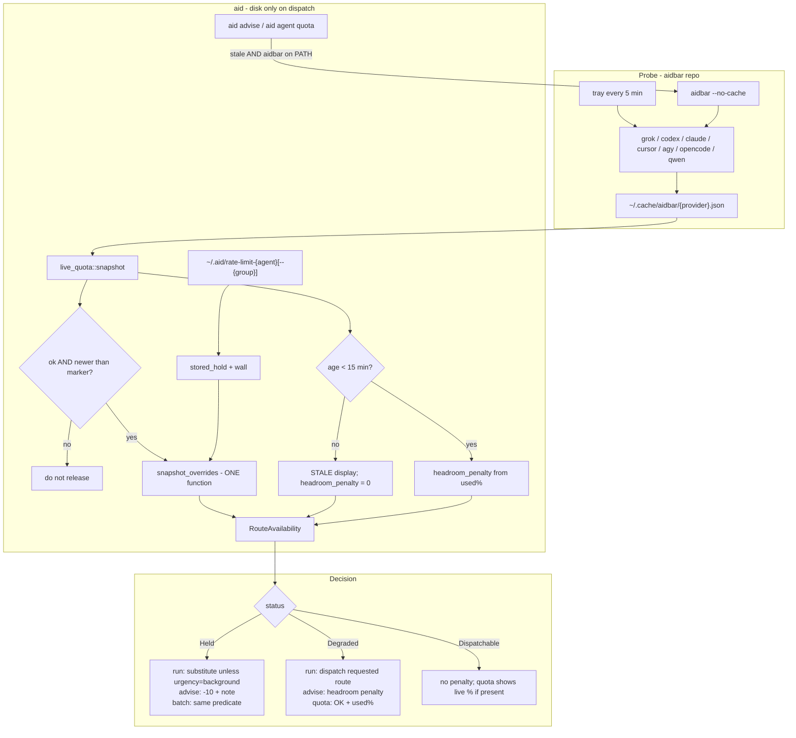

# Quota-awareness system and scheduling improvement

| Field | Value |
|---|---|
| **Author** | (design; implementer TBD) |
| **Date** | 2026-08-17 |
| **Status** | Draft |
| **Repo** | `ai-dispatch` (`/Users/mingsun/Develop/ai/ai-dispatch`) |
| **Companion** | aidbar probe contract (`/Users/mingsun/Develop/ai/aidbar`) |
| **Trigger** | Live grok hold not released after billing window recovered |

---

## Overview

aid's idea of "can this route take work?" is split across two readers that
disagree. `dispatch_blocking_hold` consults the aidbar snapshot and will release
a clock hold. `is_rate_limited` looks only at `~/.aid/rate-limit-*` and is what
`aid advise`, scoring (−10), fallback, batch, hooks, and `aid agent quota` all
use. On top of that split, Grok Build's 402 `usage balance exhausted` is
classified `NeedsHuman`, so even the dispatch reader refuses to believe a newer
snapshot that shows 0% used and a dated `resets_at`.

This design makes **one type** the source of truth for route availability,
keeps **aidbar as the only probe**, teaches the hold classifier the difference
between a prepaid wall and a dated billing window, and feeds **live headroom**
into advise / cascade / batch as a rank — not a boolean — without resurrecting
`auto` and without silently swapping a strong model for a cheap one.

The 2026-08-17 incident is the acceptance case: after this ships, a grok marker
written on a 402, plus a newer `~/.cache/aidbar/grok.json` with
`ok: true`, `used_percent: 0.0`, and `resets_at: 2026-08-18T00:55:28Z`, must
make grok **dispatchable** again (including through today's `aid run` seam,
`dispatch_blocking_hold` → one override function), must stop `aid advise` from
applying −10, and must print `OK` with the live percent on `aid agent quota`.
A grok snapshot at 0% with `resets_at: null` must stay **held**. An opencode
`insufficient balance` hold must stay **held** whether the snapshot is 0%
undated **or** 0% with a computed `resets_at`.

---

## Background & Motivation

### What happened (measured, 2026-08-17)

- Marker `~/.aid/rate-limit-grok` written 2026-08-14 13:30:
  `hold: manual`, empty `recovery_at`, message
  `API error (status 402 Payment Required): Grok Build usage balance exhausted`.
- `aid agent quota` / `aid agent list`: grok `LIMITED`,
  "held until cleared with `aid config clear-limit grok`".
- `~/.cache/aidbar/grok.json` fetched 2026-08-17 12:24 (newer than the marker):
  `ok: true`, `used_percent: 0.0`, window `Aug 11 – Aug 18`,
  `resets_at: 2026-08-18T00:55:28Z`.
- Dispatch refused or substituted grok anyway.

Write-up: `docs/investigation-grok-quota-hold-not-released.md`.

### Two stacked facts

1. **aid never probes.** The only periodic probe is aidbar's tray refresh
   (`aidbar/src/tray.rs`, `REFRESH_INTERVAL = 5 * 60`). aid only *reads*
   `~/.cache/aidbar/{provider}.json` at dispatch via `src/live_quota.rs`.
2. **Grok 402 is classified `QuotaRecovery::NeedsHuman`**
   (`src/rate_limit_signatures.rs:132`). `live_quota_can_override` is false for
   that class (`src/rate_limit.rs:250-252`). `is_rate_limited`
   (`src/rate_limit.rs:460`) does not consult live quota at all.

The v10.19 rule — "a percentage never releases a hold only a person can end" —
is correct for opencode Zen (`$19.37 / $20`; 100% is not the wall). Grok Build
was lumped into the same class because the 402 text has no reset phrase. aidbar
already knows the wall is a dated billing period
(`GetGrokCreditsConfig` → `period_end` as `resets_at`).

### What already shipped

| Version | What it did | What it left |
|---|---|---|
| v10.15 | Three hold classes (`Until` / `NeedsHuman` / `Transient`); family markers | Grok 402 → NeedsHuman |
| v10.16 | `quota_channel` containment | Adapter `parse_event` mark sites still outside the envelope |
| v10.18 | Held routes substituted before spawn (`run_dispatch_resolve.rs:147-165`) | `is_rate_limited` still marker-only; scoring still −10 boolean |
| v10.19 | Snapshot can release a **clock** hold when newer and every window has `used_percent ∈ [0, 100)` | Explicit veto for NeedsHuman; `live_quota` ignores `resets_at` |

`docs/design/agent-advise-api.md` (approved 2026-08-05) listed
"Network quota probing (separate aidbar-integration track)" as a **non-goal**.
This document is that track, plus making quota actually rank live routes.

### Divergent readers today

| Reader | File | Consults snapshot? | Used by |
|---|---|---|---|
| `is_rate_limited` | `src/rate_limit.rs:460` | no | scoring, fallback, batch, hooks, quota STATUS, `wait_for_declared_reset` |
| `dispatch_blocking_hold` | `src/rate_limit.rs:298` | yes | `aid run` substitution |
| `dispatch_blocking_hold_for_model` | `src/rate_limit.rs:302` | yes (via `dispatch_blocking_hold_at_path`) | family-group substitution |
| `is_group_rate_limited` | `src/rate_limit.rs:81-83` | no (`marker_is_active` only) | `healthy_model_for` at `run_dispatch_resolve.rs:239-242` |
| `get_rate_limit_info` / `format_hold_end` | `src/rate_limit.rs:686,726` | no | `aid agent quota`, list, JSON |
| `active_group_holds` | `src/rate_limit.rs:703` | no (`marker_is_active` only) | PARTIAL status |
| `live_quota::overrides_marker` → `record_overrides` | `src/live_quota.rs:29,83-95` | yes, **percent only** (does not read `resets_at`) | only the dispatch path |
| `clear_rate_limit_if_stale` | `src/rate_limit.rs:358` | n/a | success path; **does not prove quota** |

`pre_dispatch_fallback_choice` (`src/cmd/batch_dispatch_support.rs:184`) and
`coding_fallback_for` (`src/agent/selection_fallback.rs:92`) both call
`is_rate_limited`, so batch and cascade can skip a route that dispatch would
now consider free (or keep a route dispatch would refuse). That is the
one-rule-several-implementations shape named in the 2026-08-08 investigation.

---

## Goals & Non-Goals

### Goals

1. One predicate answers: is `(agent, optional model-group)` **dispatchable**,
   **degraded**, or **held**, **why**, and **what ends it**.
2. Every hold question — agent-level **and** group-level — is answered by
   `availability` / `availability_for_model` / `availability_for_group`.
   Run, advise, scoring, fallback, batch, quota/list/JSON, session-start,
   background wait, and `healthy_model_for` are facades over those three.
3. A live dated window with headroom can end a `Windowed` hold (grok
   agent-level; cursor premium / Plan only). A percentage alone cannot
   end a `Windowed` hold, a prepaid hold, or a plan-change hold. That
   dated check lives in **one** function both `availability()` and
   `overrides_marker` call.
4. `aid advise` ranks remaining headroom and time-to-reset. It does not pick
   silently. The orchestrator still declares difficulty / budget / urgency / rigor.
5. `aid agent quota` / list / JSON show live percent and freshness, not only
   marker text.
6. Write path: signatures name the wall; adapters cannot forge a hold from
   model-authored bytes; family vs agent marking stays in `mark_rate_limited_for_model`.
7. Operator escape hatch remains `aid config clear-limit`. Substitution is
   logged as a structured event that names both routes.

### Non-Goals

- A daemon inside aid. aidbar is the probe.
- Duplicating provider HTTP/proto/cookie probes in this repo.
- Resurrecting `auto`.
- Changing the capability matrix or inventing grok capability scores from
  unused quota. Quota ranks among capable routes; it does not mint capability.
- Silently substituting a weaker model on the same pool (KB:
  `eng-knowledge-base/ai-coding/agent-selection-and-model-tiers.md`).
- Flattening `NeedsHuman` for opencode prepaid, droid `reload your tokens`,
  or gemini `IneligibleTier`. Cursor premium is `Windowed` on Plan, not
  flattened to prepaid.
- Inventing a reset time aid never observed in refusal text or in a snapshot
  `resets_at`.
- Rewriting existing marker files. On-disk format stays; read-side
  reclassification is enough.
- A copilot / oz / droid / kilo / mimocode / commandcode / gemini probe in
  the first landing. Mapping them is a later aidbar PR; until then they stay
  "no evidence". Do not invent a `commandcode.json` reader.

---

## Key Decisions

1. **aid remains a consumer of `~/.cache/aidbar/{provider}.json`.**
   aidbar already probes grok, codex, claude, cursor, agy, opencode, qwen on a
   5-minute tray timer and exposes `aidbar --no-cache` as a one-shot refresh.
   Duplicating those probes (gRPC-web protobuf, Keychain, cookie DB, local
   Antigravity RPC) inside a CLI that is not a long-running process is the
   worse design. A stopped tray does not invent a second scheduler: override
   still accepts a snapshot newer than the marker (v10.19); ranking treats
   a 15-minute-old percent as absence of evidence.

2. **Absence of evidence is not availability.**
   Missing cache, `ok: false`, unmapped provider (copilot, oz, droid, kilo,
   mimocode, commandcode, gemini, custom), or empty windows leave a marker
   in force and contribute **zero** to ranking. A snapshot older than
   15 minutes is absence of evidence for **ranking and the STALE tag only**
   (Decision 6). This is the v10.19 invariant and it stays.

3. **One type, `RouteAvailability`, is the only reader.**
   Every hold question goes through `availability` /
   `availability_for_model` / `availability_for_group`. These five functions
   are facades over those three constructors and must not reimplement policy:

   - `is_rate_limited`
   - `is_group_rate_limited`
   - `dispatch_blocking_hold`
   - `dispatch_blocking_hold_for_model`
   - `active_group_holds`

   `dispatch_blocking_hold_at_path` is deleted once the constructors own the
   path. `healthy_model_for` must see the same group answer as
   `dispatch_blocking_hold_for_model`, or a recovered family still triggers
   a silent model-class swap.

4. **Split `NeedsHuman` at the signature, not at the snapshot.**
   Add `QuotaRecovery::Windowed`: no clock in the refusal; a **dated** live
   window may end it; a bare percentage may not. Two needles move to
   `Windowed` in PR-3, now, with a revert caveat in the signature comment:
   - Grok `usage balance exhausted` (agent-level). If a future 402 arrives
     in the same minute as an aidbar snapshot that still shows headroom,
     grok moves back to `NeedsHuman`. Do not wait for that 402 before landing.
   - Cursor `you're out of usage` (premium **group** only). A dated Plan
     window with `used_percent ∈ [0, 100)` releases `rate-limit-cursor--premium`.
     `auto` stays dispatchable. This needle must not write
     `rate-limit-cursor`.

   OpenCode / kilo / mimocode `insufficient balance`, droid
   `reload your tokens`, gemini `IneligibleTier`, agy
   `migrate to antigravity`, and copilot's undated monthly/premium needles
   stay `NeedsHuman`. Write-time still writes `hold: manual` with empty
   `recovery_at` — we do not invent a clock.

5. **A percentage never releases a hold whose wall is not the percentage.**
   Override of a `Windowed` hold requires `resets_at.is_some()` on at least one
   relevant window **and** every relevant window in `[0, 100)`. Clock holds
   (`Until`) keep the v10.19 rule (headroom, no date required, **no age
   cap**). Prepaid and plan-change holds are never snapshot-released, even
   if a later aidbar change starts filling `resets_at` on spend windows.

   This table is implemented in **one** function,
   `snapshot_overrides(hold, snapshot, relevant_windows)`. Both
   `availability()` and `live_quota::overrides_marker` call it. PR-1 moves
   today's dispatch policy into that function (still vetoes grok and
   cursor premium; those rows flip in PR-3). The
   `Windowed` dated arm is compiled in PR-1 and becomes live when PR-3
   flips the grok and cursor-premium rows — never via a second
   `record_overrides` that ignores `resets_at`. The required undated-0%
   grok test is pinned on `dispatch_blocking_hold`, not only on the new
   type. Cursor premium is pinned on `dispatch_blocking_hold_for_model`
   with Plan 0% dated **and** On-demand 115% (On-demand is not relevant).

6. **Staleness is ranking/display only. Override keeps v10.19.**
   aidbar's default TTL is 300s and the tray refreshes every 5 minutes.
   A snapshot older than **15 minutes** (`3 ×` refresh) is tagged `STALE`
   and contributes **zero** to `headroom_penalty`. It does **not** block
   override. Override requires only: `ok`, provider match, `fetched_at`
   newer than the marker mtime, §C wall, headroom, and (for `Windowed`)
   a dated `resets_at`. A tray-down machine with a 20-minute-old snapshot
   that is still newer than the marker must release a recovered clock or
   Windowed hold, as v10.19 does today. Chosen split: a 3-day-old percent
   should not retune advise scores; it should still self-correct dispatch
   after a top-up.

7. **aid may spawn `aidbar` only from `aid advise` and `aid agent quota`,
   and only for already-stale mapped providers.**
   Dispatch (`aid run`, batch spawn) is disk-only. Do **not** spawn a
   single `aidbar --no-cache` against every enabled provider with an 8s
   wall: that binary refreshes the whole set sequentially, and grok's own
   HTTP timeout is already 10s (`aidbar/src/providers/grok.rs:24`). Until
   aidbar grows a per-id refresh flag, a failed or timed-out spawn is
   absence of evidence and advise stays on the disk cache — it does **not**
   promise current percents. `AID_QUOTA_REFRESH=0` disables the spawn. If
   `aidbar` is not on `PATH`, stay disk-only. This is not a daemon.

8. **Quota ranks; it does not boost.**
   Headroom applies a penalty as used% climbs. Unused quota never adds score.
   A held route keeps today's −10 (`rate_limit_penalty`) when urgency is not
   `background`. Capability, history, and declared profile still dominate.
   This is why grok-with-0%-used does not leapfrog codex: grok's matrix row is
   still a 4.

9. **The orchestrator decides; aid informs.**
   Declared `--difficulty --budget --urgency --rigor` stay required on advise.
   `auto` stays deleted. A substitution that changes CLI drops model and
   session (already `switch_agent`). The warning and the milestone must name
   both routes and whether the model class was preserved. Do not pick a cheaper
   model on the same pool without saying so (`healthy_model_for` already warns;
   that warning becomes a structured event).

10. **`--urgency background` may wait only when a clock or a mapped probe
    exists.** Today's `wait_for_declared_reset` polls `is_rate_limited` forever
    on a human hold. After this change: clock → wait until `recovery_at` or
    snapshot release; Windowed + mapped probe → wait for snapshot; prepaid /
    plan-change / unmapped → refuse the wait and tell the operator to
    `clear-limit` or pick another agent.

11. **Grok's `MeteringShape` becomes `AccountPool`.**
    `src/types/provider.rs:141` currently records `Unknown` ("CLI exposes no
    billing surface"). aidbar's `GetGrokCreditsConfig` mapping
    (`aidbar/src/providers/grok.rs:107-120`) is the missing observation: one
    billing-period pool, `used_percent` + `period_end`. That is evidenced, not
    invented.

12. **Marker files on disk keep working without a rewrite. `hold: manual`
    must not win before a Windowed re-read.**
    The incident file is `hold: manual` + grok 402 text and empty
    `recovery_at`. Today's `stored_hold` (`src/rate_limit.rs:236-247`)
    returns `NeedsHuman` on `hold: manual` **before** any signature
    re-read, so flipping only the grok row is a no-op. The algorithm
    in §C is the migration: Windowed signature match runs **before**
    the `hold: manual` short-circuit. Unmatched `hold: manual` (no
    Windowed needle, no NeedsHuman needle) stays `NeedsHuman` — it
    must **not** collapse to `Transient` and expire on the 300s mtime
    window (truncated messages, removed needles, hand-written markers).
    OpenCode files stay `NeedsHuman`.

13. **New code goes in new files. Classification leaves `rate_limit.rs`
    in PR-1.** `src/rate_limit.rs` is 1187 lines. PR-1 moves `stored_hold`,
    `wall_of`, `snapshot_overrides`, and hold-end formatting into
    `src/route_availability.rs` (split `route_availability_policy.rs` if
    the type file would exceed 300). Snapshot parsing stays in
    `src/live_quota.rs`. Optional refresh is `src/live_quota_refresh.rs`.
    PR-3 touches `rate_limit_signatures.rs`, `types/provider.rs`, tests,
    changelog, and the guide — it does not grow `rate_limit.rs`. Scoring
    increment is a small helper next to `selection_scoring.rs`.

14. **Cursor premium matches the `Plan` window only, by evidenced label.**
    Chosen over waiting on `windows[].group` (PR-7) so
    `aid run cursor -m <premium>` works after a new Plan cycle in the
    same landing as grok. Aidbar already writes cursor windows as exactly
    `Plan` and `On-demand` (`aidbar/src/providers/cursor.rs:229,243`) and
    puts `billing_cycle_end` on both as `resets_at`. Live machines have
    shown On-demand at 115% while Plan had headroom — if "every relevant
    window" included On-demand, premium would never release. Relevant
    window for group `premium` is the window whose `label` equals `Plan`
    (case-insensitive). `On-demand` is never relevant for that group.
    This is a closed exception for two unambiguous labels, not a general
    infer-group table: agy `"Claude and GPT models 5h"` still fail-closes
    until PR-7. If `windows[].group` is present later, it wins over the
    label.

---

## Proposed Design

### End-to-end flow



### A. Single source of truth

New module `src/route_availability.rs` (≤300 lines) plus sibling
`src/route_availability_tests.rs`.

```rust
/// What is actually stopping work on this route, if anything.
#[derive(Clone, Debug, PartialEq)]
pub struct RouteAvailability {
    pub status: RouteStatus,
    pub wall: QuotaWall,
    pub ends: HoldEnd,
    pub why: String,
    pub marker: Option<MarkerEvidence>,
    pub probe: Option<ProbeEvidence>,
}

#[derive(Clone, Copy, Debug, PartialEq, Eq)]
pub enum RouteStatus {
    /// Nothing aid knows should stop a dispatch.
    Dispatchable,
    /// Dispatchable, but the live window is tight. Ranking only.
    Degraded,
    /// Must not be spawned (unless urgency = background).
    Held,
}

/// The thing that has to change for this route to serve again.
#[derive(Clone, Copy, Debug, PartialEq, Eq)]
pub enum QuotaWall {
    Clock,       // stated or signature After(N)
    Windowed,    // no clock in the refusal; dated snapshot may end it
    Prepaid,     // top-up; percentage is not the wall
    PlanChange,  // IneligibleTier / migrate / admin
    Transient,   // 300s cooldown; not a dispatch gate
    None,        // no marker
}

#[derive(Clone, Debug, PartialEq)]
pub enum HoldEnd {
    At(chrono::NaiveDateTime),
    ClearLimit { slug: String },
    SnapshotDatedWindow,
    Cooldown,
    Nothing,
}

#[derive(Clone, Debug, PartialEq)]
pub struct ProbeEvidence {
    pub provider: String,
    pub fetched_at: chrono::DateTime<chrono::Utc>,
    pub age: std::time::Duration,
    pub stale: bool,
    pub ok: bool,
    pub windows: Vec<WindowView>,
}

#[derive(Clone, Debug, PartialEq)]
pub struct WindowView {
    pub label: String,
    pub used_percent: f64,
    pub resets_at: Option<chrono::DateTime<chrono::Utc>>,
    pub group: Option<String>, // from aidbar when present; None = unmatched group fails closed
}
```

Public constructors — these **own** policy from PR-1. They do not delegate
to `is_rate_limited` / `dispatch_blocking_hold` (that is a cycle; see PR Plan).

```rust
pub fn availability(agent: &AgentKind, custom_name: Option<&str>) -> RouteAvailability;

pub fn availability_for_model(
    agent: &AgentKind,
    custom_name: Option<&str>,
    model: Option<&str>,
) -> RouteAvailability;

pub fn availability_for_group(
    agent: &AgentKind,
    custom_name: Option<&str>,
    group: &str,
) -> RouteAvailability;
```

Composition rule (agent-level; group-level is the same on the group marker):

1. Read the marker. Classify `stored_hold` (algorithm in §C, includes `Windowed`).
2. Read the aidbar snapshot for `provider_name(agent)` if mapped.
3. Call `snapshot_overrides` (§C). If it returns true → `Dispatchable` (or
   `Degraded` if used% is high **and** the snapshot is not STALE),
   `ends = Nothing`, `why` names the snapshot.
4. Else if marker is an active `Until` / `Windowed` / `NeedsHuman` → `Held`.
5. Else if only *other* group markers are active → `Dispatchable` at agent
   level (`PARTIAL` for display). Callers that have a model use
   `availability_for_model`.
6. Else if a **non-stale** snapshot exists and max used% ≥ 80 → `Degraded`.
7. Else `Dispatchable`. Transient cooldown is `Degraded` for display and
   scoring, **not** `Held` (same as today's dispatch gate).

#### Facades (PR-2; no policy of their own)

```rust
pub fn is_rate_limited(agent: &AgentKind, custom_name: Option<&str>) -> bool {
    matches!(availability(agent, custom_name).status, RouteStatus::Held)
}

pub fn is_group_rate_limited(agent: &AgentKind, custom_name: Option<&str>, group: &str) -> bool {
    matches!(availability_for_group(agent, custom_name, group).status, RouteStatus::Held)
}

pub fn dispatch_blocking_hold(agent: &AgentKind, custom_name: Option<&str>) -> Option<String> {
    hold_text(&availability(agent, custom_name))
}

pub fn dispatch_blocking_hold_for_model(
    agent: &AgentKind,
    custom_name: Option<&str>,
    model: Option<&str>,
) -> Option<String> {
    hold_text(&availability_for_model(agent, custom_name, model))
}

pub fn active_group_holds(
    agent: &AgentKind,
    custom_name: Option<&str>,
) -> Vec<(String, RateLimitInfo)> {
    // each group via availability_for_group; skip status != Held
}

fn hold_text(a: &RouteAvailability) -> Option<String> {
    match a.status {
        RouteStatus::Held => Some(format_hold_end_from(a)),
        _ => None,
    }
}
```

`dispatch_blocking_hold_at_path` and the current `record_overrides` body
are deleted once these facades land. PR-2 is not done until a group-hold
fixture with `windows[].group` set produces the **same** answer from
`aid agent quota` PARTIAL, `healthy_model_for`, and
`dispatch_blocking_hold_for_model`.

`get_rate_limit_info` grows optional probe fields (additive). Existing
`recovery_at` / `message` / `needs_human` stay. `needs_human` is true only for
`Prepaid` and `PlanChange`, not for `Windowed`. `format_hold_end` gains a
`Windowed` arm in PR-1 (so a later signature flip cannot print
`"cooling down"`):

```text
Until           → "resets {recovery_at}"
Windowed        → "until a dated {provider} snapshot with headroom (or `aid config clear-limit {slug}`)"
NeedsHuman      → "held until cleared with `aid config clear-limit {slug}`"
Transient       → "cooling down"
```

### B. Probe / freshness architecture

#### Ownership

| Concern | Owner |
|---|---|
| Credentials, HTTP, proto, cookies | aidbar |
| Periodic refresh (5 min) | aidbar tray |
| On-demand refresh | `aidbar --no-cache` (already shipped, `aidbar/src/main.rs`) |
| Cache record schema | aidbar `UsageSnapshot` / `UsageWindow`; aid deserializes a **superset** |
| Freshness, override, ranking | aid |
| Marker write / signature class | aid |

aid does **not** grow `launchd`, a background thread, or a copy of
`GetGrokCreditsConfig`.

#### Cache contract (current, already in `src/live_quota.rs`)

```json
{
  "ok": true,
  "snapshot": {
    "provider": "grok",
    "plan": null,
    "windows": [
      {
        "label": "Aug 11 – Aug 18",
        "used_percent": 0.0,
        "resets_at": "2026-08-18T00:55:28Z"
      }
    ],
    "fetched_at": "2026-08-17T12:24:00Z"
  }
}
```

Today `UsageWindow` in aid only deserializes `used_percent`. That is why a dated
window cannot participate in policy. Expand the struct (unknown fields already
ignored by aidbar; adding fields in aid is backward compatible):

```rust
struct UsageWindow {
    used_percent: f64,
    #[serde(default)]
    label: String,
    #[serde(default)]
    resets_at: Option<DateTime<Utc>>,
    #[serde(default)]
    group: Option<String>, // new, optional, aidbar PR later
}
```

Error records (`ok: false`, `snapshot: null`) stay non-overriding
(existing test `aidbar_error_records_have_no_snapshot_to_override`).

#### Freshness

```text
STALE_AFTER = 15 minutes   // ranking + STALE tag only
```

| Snapshot state | Override? (v10.19 + §C) | Rank (`headroom_penalty`)? | Display |
|---|---|---|---|
| missing / unmapped | no | no | `source=marker`, no % |
| `ok: false` | no | no | `source=probe-error`, error text |
| `fetched_at` ≤ marker mtime | no | yes if age < 15 min | show %, note "older than marker" |
| age ≥ 15 min, newer than marker | **yes, per §C** | no | show %, tag `STALE` |
| age < 15 min, `ok`, newer than marker | per §C | yes | show % |

`live_quota.rs` grows `fn snapshot(agent) -> Option<ProbeEvidence>` (parse
only; no policy). `overrides_marker` becomes:

```rust
pub(crate) fn overrides_marker(agent: &AgentKind, marker_path: &Path) -> bool {
    crate::route_availability::overrides_marker_at(agent, marker_path)
}
```

which reads the marker, classifies `stored_hold`, loads the snapshot, and
calls `snapshot_overrides`. There is no second percent-only path.

#### When aid fetches

```text
aid advise / aid agent quota
    if AID_QUOTA_REFRESH is not "0" and `aidbar` is on PATH
        for each mapped provider whose cache is missing or age ≥ 15 min:
            prefer a per-id refresh if aidbar grows that flag
            otherwise one `aidbar --no-cache` is best-effort only
        per-provider timeout (not one 8s wall for the whole set)
        non-zero / timeout / missing binary → keep the disk cache;
            do not claim the percents are current

aid run / batch / hook session-start / wait
    never spawn; disk only
```

Rationale: advise and quota exist to give the caller a picture
(`docs/design/agent-advise-api.md`). They must not block on seven sequential
provider HTTP calls (grok's probe timeout is already 10s). A failed spawn
leaves advise on whatever cache is on disk — same as today, plus a note
`quota refresh failed; using disk cache`. Dispatch is a hot path and never
spawns. Session-start is injected into every Claude session — a multi-second
spawn there is worse than a slightly stale line.

If the tray is running, caches are ≤5 minutes old and advise does not spawn.
If the tray is not running and the operator never installed aidbar, advise
stays marker-only (absence ≠ availability) and notes say
`no live quota (aidbar not on PATH)`.

#### Unmapped providers

`live_quota::provider_name` today:

```
codex, claude, opencode, cursor, agy, grok, qwen  → Some
copilot, oz, droid, kilo, mimocode, gemini, commandcode, custom → None
```

Unmapped stays `None`. A later aidbar probe is a separate PR that adds an
id to aidbar's `providers::all()` and one arm here. Until then, those
agents are marker-only. Do not treat "no snapshot" as "unlimited". Do not
invent a `commandcode.json` reader.

Gemini is unmapped even though it has signatures: individual-tier users are
supposed to migrate to agy; a gemini usage probe would describe a CLI we
already treat as permanently unhealthy when agy is installed
(`selection_fallback.rs:98-100`).

#### aidbar contract evolution (separate repo, optional first landing)

Keep the current schema working. Additive fields only:

| Field | Where | Why |
|---|---|---|
| `windows[].group` | `UsageWindow` | **Required** before any **agy** group-hold override. Live aidbar labels (`"{group.displayName} {bucket.displayName}"`, e.g. `"Gemini Models Weekly"`, `"Claude and GPT models 5h"` in `aidbar/src/providers/agy.rs:230-234`) cannot be substring-matched onto aid's `groups_for_agent` (`gemini` / `claude` / `gpt-oss`): the second label contains both `claude` and `gpt`. Cursor does **not** wait on this field (Decision 14). |
| `windows[].remaining` + `remaining_unit` | `UsageWindow` | prepaid absolute remaining. **Not used for override in v1** — opencode's wall is still the 401, not the spend window |

Do not require these fields to ship the grok fix. Grok is agent-level (one
window, `resets_at` already present).

**No general label-inference table.** Group-hold override uses an explicit
`windows[].group` that equals the marker group, **except** the cursor
`Plan` / `On-demand` labels (Decision 14). If neither `group` nor that
exception matches, fail closed: the group stays `Held`. Agy family holds
stay held until PR-7 writes `group`. Agent-level holds (grok, codex, qwen)
still use every window, as today.

### C. Hold classes vs live evidence

#### Write-time (`classify_hold`, unchanged shape)

Priority stays: stated absolute time → relative time → signature class →
Transient. A copilot message that names a date is still `Until`, not human.

New signature variant:

```rust
pub enum QuotaRecovery {
    After(i64),
    NeedsHuman,
    /// No clock in the refusal. A dated live window may end it.
    /// A percentage without a date may not. `After` is not used as a floor:
    /// inventing a clock is how grok's 402 used to expire in five minutes.
    Windowed,
}
```

Write of `Windowed` produces the same bytes as `NeedsHuman`:

```
recovery_at:
hold: manual
provider: unknown
message: …
```

so existing files and `clear-limit` stay valid. The distinction is recovered
on read from the stored message + current signature table. **Order is
load-bearing** — today's function (`src/rate_limit.rs:236-247`) returns
`NeedsHuman` on `hold: manual` before any signature re-read, which is why
flipping only the grok row would leave the incident file dark.

#### Read-time `StoredHold` (this is the algorithm; freeze it in PR-1 tests)

```rust
enum StoredHold {
    Until(NaiveDateTime),
    Windowed,
    NeedsHuman, // Prepaid or PlanChange; see wall_of()
    Transient,
}

fn stored_hold(content: &str, agent: &AgentKind) -> StoredHold {
    if let Some(recovery_at) = marker_field(content, "recovery_at: ")
        .as_deref()
        .and_then(parse_recovery_datetime)
    {
        return StoredHold::Until(recovery_at);
    }
    // Windowed BEFORE hold: manual. The incident file is:
    //   recovery_at:\n hold: manual\n provider: unknown\n
    //   message: API error (status 402 Payment Required): Grok Build usage balance exhausted
    // If manual wins first, a Windowed signature is a no-op.
    if stored_refusal_matches(content, agent, QuotaRecovery::Windowed) {
        return StoredHold::Windowed;
    }
    if marker_field(content, "hold: ").as_deref() == Some(MANUAL_HOLD)
        || stored_refusal_matches(content, agent, QuotaRecovery::NeedsHuman)
    {
        return StoredHold::NeedsHuman;
    }
    StoredHold::Transient
}

fn stored_refusal_matches(content: &str, agent: &AgentKind, want: QuotaRecovery) -> bool {
    content.lines().any(|line| {
        parse_recovery_time(line).is_none()
            && parse_relative_recovery(line).is_none()
            && match_quota_signature_for_agent(line, *agent) == Some(want)
    })
}
```

Unmatched `hold: manual` (no Windowed needle, no NeedsHuman needle) stays
`NeedsHuman`. It must **not** become `Transient`. A hand-written or
truncated marker would otherwise expire on the 300s mtime window.

```rust
fn wall_of(agent, content) -> QuotaWall {
    match stored_hold(content, agent) {
        StoredHold::Until(_) => QuotaWall::Clock,
        StoredHold::Windowed => QuotaWall::Windowed,
        StoredHold::NeedsHuman => match signature_for_stored(agent, content) {
            Some(needle) if PLAN_CHANGE_NEEDLES.contains(needle) => QuotaWall::PlanChange,
            _ => QuotaWall::Prepaid,
        },
        StoredHold::Transient => QuotaWall::Transient,
    }
}

/// THE only override policy. Called by availability() and by
/// live_quota::overrides_marker. No age cap — v10.19 newer-than-marker.
fn snapshot_overrides(
    hold: StoredHold,
    snapshot: &ProbeEvidence,
    marker_mtime: SystemTime,
    relevant: &[WindowView],
) -> bool {
    if !snapshot.ok || snapshot.fetched_at <= DateTime::<Utc>::from(marker_mtime) {
        return false;
    }
    if relevant.is_empty() {
        return false; // unmatched group: fail closed
    }
    if !relevant.iter().all(|w| (0.0..100.0).contains(&w.used_percent)) {
        return false;
    }
    match hold {
        StoredHold::Until(_) | StoredHold::Transient => true,
        StoredHold::Windowed => relevant.iter().any(|w| w.resets_at.is_some()),
        StoredHold::NeedsHuman => false,
    }
}

fn relevant_windows(
    snapshot: &ProbeEvidence,
    agent: &AgentKind,
    group: Option<&str>,
) -> Vec<WindowView> {
    match group {
        None => snapshot.windows.clone(), // agent-level: every window
        Some(g) => {
            let by_field: Vec<_> = snapshot
                .windows
                .iter()
                .filter(|w| w.group.as_deref() == Some(g))
                .cloned()
                .collect();
            if !by_field.is_empty() {
                return by_field; // PR-7 field wins when present
            }
            // Evidenced exception — not a general infer-group table.
            // aidbar cursor labels are exactly "Plan" and "On-demand"
            // (cursor.rs:229,243). On-demand has been 115% while Plan
            // had headroom; it must not be relevant for premium.
            if *agent == AgentKind::Cursor && g.eq_ignore_ascii_case("premium") {
                return snapshot
                    .windows
                    .iter()
                    .filter(|w| w.label.eq_ignore_ascii_case("plan"))
                    .cloned()
                    .collect();
            }
            Vec::new() // fail closed (agy, unknown groups)
        }
    }
}
```

`PLAN_CHANGE_NEEDLES`: `ineligibletier`, `migrate to antigravity`.
Everything else in the current `NeedsHuman` set is prepaid / admin
(`insufficient balance`, `reload your tokens`,
`premium request limit`, `exceeded your monthly quota`).
Cursor `you're out of usage` is **not** in this set after PR-3.

#### Signature table changes (PR-3: two rows)

```rust
// grok — land now; revert to NeedsHuman if a 402 arrives while
// the same-minute aidbar snapshot still has headroom
QuotaSignature { agent: Grok, needle: "usage balance exhausted", recovery: Windowed }
// cursor premium group — Plan window only (Decision 14)
QuotaSignature { agent: Cursor, needle: "you're out of usage", recovery: Windowed }
```

Write path is unchanged: `group_from_refusal` still maps this cursor
needle to `premium` (`src/agent/model_group.rs:82-96`), so the marker
is `rate-limit-cursor--premium`, never `rate-limit-cursor`. `auto` stays
dispatchable. Copilot stays `NeedsHuman` until a probe exists — a dated
window we do not have cannot release it.

#### Override table

Let `S` be an `ok`, provider-matching snapshot with `fetched_at` **newer
than the marker mtime**. Age is not a column — a 20-minute-old snapshot
still overrides if it is newer than the marker. Let `W` be the relevant
windows (`relevant_windows`: all windows for an agent-level hold; for a
group hold, windows whose `group` field equals the marker group, or —
cursor `premium` only — the window whose `label` is `Plan`).

| Marker class | S missing / not newer | S present, any relevant window 100% or empty W | S present, all relevant in `[0, 100)`, no `resets_at` | S present, all relevant in `[0, 100)`, ≥1 `resets_at` |
|---|---|---|---|---|
| `Until` (clock) | hold | hold | **release** (v10.19) | **release** |
| `Windowed` (grok agent; cursor premium / Plan) | hold | hold | **hold** | **release** |
| `NeedsHuman` prepaid | hold | hold | **hold** | **hold** |
| `NeedsHuman` plan-change | hold | hold | **hold** | **hold** |
| `Transient` | not a gate | not a gate | not a gate | not a gate |

That is the whole policy. The grok incident and the cursor Plan-cycle
case sit in the last column of the `Windowed` row. The opencode fixture
in `src/live_quota.rs:216-238` (`resets_at: null`, 96.86%) stays in the
prepaid row and cannot move. An On-demand window at 115% does not move
cursor premium into the "any relevant window 100%" column — On-demand
is not relevant.

Do **not** copy `resets_at` into the marker's `recovery_at`. The snapshot is
evidence that the window is open **now**; writing a clock aid did not parse
from the provider's refusal is inventing a reset time.

#### Family / tier

- Cursor premium group hold: `Windowed` on `you're out of usage`. The
  agent stays dispatchable (`PARTIAL` / `is_rate_limited(Cursor) == false`)
  while premium is held — `auto` is not this group (`model_group.rs:59-70`).
  Relevant window is **Plan only**. A newer snapshot with Plan
  `used_percent ∈ [0, 100)` and `resets_at` (aidbar writes
  `billing_cycle_end`) releases `rate-limit-cursor--premium` even if
  On-demand is 115%. A Plan window at 100%, or Plan with no `resets_at`,
  does not. Do not write an agent-level `rate-limit-cursor` from this
  needle.
- Agy family hold: already `After(60)` / stated `resets in 59m`. Group-hold
  override uses only windows whose `group` field equals the marker group.
  Until PR-7 writes that field, agy group holds **fail closed** (stay held)
  even if one family recovered. Do not infer from labels: live aidbar
  `"Claude and GPT models 5h"` matches both `claude` and `gpt-oss` under
  any substring table, and aid's `groups_for_agent` still splits those
  families. Agent-level override still requires every window.
- OpenCode provider group (`rate-limit-opencode--{provider}`): prepaid
  signature, never snapshot-released.

#### What a successful run proves

Unchanged: `clear_rate_limit_if_stale` only deletes a marker **older than
`task_start`**. A success is not evidence of remaining quota. A 402 observed
mid-run must survive the success path. Documented in
`src/rate_limit.rs:349-355`; do not "fix" this.

### D. Scheduling / recommendation improvement

Quota today is a boolean −10 on `is_rate_limited` and a hard pre-dispatch
gate. After the SoT lands, the boolean at least matches reality. This section
turns the live window into a **rank**.

#### Scoring

`ScoreBreakdown` already serializes to advise JSON. Add one field (JSON keys
may be added, never renamed — `docs/design/agent-advise-api.md` invariant):

```rust
pub struct ScoreBreakdown {
    // existing fields unchanged, same addition order
    pub base: f64,
    pub model_capability: f64,
    pub budget_penalty: f64,
    pub rate_limit_penalty: f64, // -10 iff status == Held && penalize_rate_limit
    pub history_bonus: f64,
    pub complexity_bonus: f64,
    pub team_bonus: f64,
    pub headroom_penalty: f64,   // NEW, ≤ 0
    pub total: f64,
}
```

`total` adds `headroom_penalty` after `team_bonus`. When there is no fresh
snapshot and the route is not `Held`, `headroom_penalty == 0` and `score_for`
is bit-identical to today (extend `selection_score_tests.rs`).

```text
headroom_penalty, from the tightest relevant window's used_percent:

  no fresh evidence          0.0
  used ∈ [0, 50)             0.0
  used ∈ [50, 80)           -1.0
  used ∈ [80, 95)           -3.0
  used ∈ [95, 100)          -6.0
  used == 100, not Held     -6.0   # degraded only; Held uses rate_limit_penalty
```

`rate_limit_penalty` stays −10 when `status == Held` and
`penalize_rate_limit` is true. It is **not** replaced by headroom. Two
separate facts: "this route cannot take work" vs "this route is filling up".

`penalize_rate_limit` is already false for `--urgency background`
(`selection_advice.rs:106`). Background work therefore keeps a held agent at
the top of the list (the caller asked to wait) and the notes say so.

No positive term for unused quota. That would let grok's 0% paper over a
capability of 4.

Time-to-reset is **not** a numeric term in v1. It is a note
(`codex LIMITED until 18:27; 3h left`). A second numeric axis on top of
−10 / headroom would retune every fixture for a small gain. Revisit if
measured.

Family vs agent: score the **route** (`availability_for_model` when advise
has already picked a budget model). A cursor premium hold must not −10 the
`auto` candidate. Today `score_breakdown` calls `is_rate_limited(&kind, None)`,
which is agent-level — cursor premium is already not an agent hold. Keep that.
When we later score per-model, pass the model in.

Cost of switching: not a score term. It is a **note and an event** (below).
Putting "switch cost" into the number would hide a model-class drop inside a
float.

#### `aid advise`

`rate_limit_notes` (`selection_advice.rs:238`) today: `is_rate_limited` plus
optional `recovery_at`. Replace with notes built from `RouteAvailability`:

```
codex held until Aug 11, 2026 2:23 PM (clock; probe 2m ago 0% weekly — override would apply if newer than marker)
grok held until dated snapshot (windowed; probe 3m ago 0% Aug 11–18 resets 2026-08-18)
opencode held until `aid config clear-limit opencode` (prepaid; probe 96.86% 5h resets_at=null; percentage is not the wall)
cursor premium PARTIAL — auto still dispatchable
qwen degraded 87% of 5h window (resets 18:12)
copilot held (no probe)
```

Human output gains the headroom column and a `quota` suffix on the
recommended line when the pick is a substitute for a held first choice:

```
Recommended: droid/…   score 11.4   ~$…  ~…
  1. codex   3.2   …  -10.0 limit  …
  2. droid  11.4   …
Notes: urgent + codex held until 18:27 → switch to droid (different provider; model class not preserved)
```

JSON: add on each candidate (additive):

```json
"quota": {
  "status": "held|degraded|dispatchable",
  "wall": "clock|windowed|prepaid|plan_change|transient|none",
  "used_percent": 0.0,
  "resets_at": "2026-08-18T00:55:28Z",
  "freshness_secs": 180,
  "stale": false,
  "source": "probe|marker|none"
}
```

`AdviceCandidate.quota` is new. `recommended.reason` already names the
declared profile; append the quota clause only when it changed the pick.

Exit 0 when every agent is held stays (existing e2e).

#### `aid run` substitution / cascade

`resolve_agent_setup` already substitutes on `dispatch_blocking_hold`. After
SoT that function agrees with advise. Changes:

1. **Urgency** (already): `background` keeps the requested agent and warns.
   After §D wait policy, `wait_for_declared_reset` will actually terminate
   for Windowed+probe and will refuse to sleep forever on prepaid.
2. **Cascade then `coding_fallback_for_prompt`**, already in
   `skip_held_to_fallback`. Fallback's `is_usable_fallback` starts calling
   `availability(...).status != Held` via the `is_rate_limited` wrapper.
3. **Do not carry model or session** (`switch_agent`). Keep. The milestone
   must say that.
4. **Structured event** (see Observability). The current string
   `Held route skipped: grok (…) — dispatching to claude instead` stays as
   `detail`; `metadata` becomes JSON.
5. **Model-class warning.** If the replacement's `model_for_task_budget`
   tier is below the original's, the warn line says
   `weaker class (premium → cheap)`. If there is no catalog entry, say
   `model class unknown`. Never imply the same model followed the CLI.

`--cascade` order still wins over auto-fallback. Auto-fallback still skips
gemini when agy is installed.

#### Batch

`pre_dispatch_fallback_choice` and the batch warning loop switch to the SoT
by using `is_rate_limited` after it is a wrapper — no separate batch
predicate.

Declared urgency on a batch task (already on the TOML profile):

| urgency | blocking hold, fallback exists | blocking hold, no fallback | degraded |
|---|---|---|---|
| `urgent` / `normal` | substitute now (today's path) | do not spawn; mark skipped with the hold text | dispatch as requested |
| `background` | keep agent; wait per §D.10 | keep agent; wait or refuse wait | dispatch as requested |

Do not invent a fourth "wait in the batch scheduler" state. Background wait
already lives in `src/rate_limit_wait.rs` on the run path, and batch goes
through `aid run`.

#### `aid agent quota` / list / JSON

`quota_row` (`src/cmd/agent_display.rs:84`) and `build_quota_json`
(`src/cmd/agent_json.rs:196`) both call `is_rate_limited` +
`active_group_holds`. After PR-2 those two are facades over
`availability` / `availability_for_group`, so agent-level **and** group
STATUS follow the same override table as `aid run`. Display additions:

Text (`aid agent quota`):

```
AGENT        STATUS     DETAIL
grok         OK         0%  Aug 11–Aug 18  resets 2026-08-18T00:55Z  probe 3m ago
codex        LIMITED    until Aug 11, 2026 2:23 PM — hit your usage limit
opencode     LIMITED    held until cleared with `aid config clear-limit opencode`  (prepaid; probe 97% 5h, no date)
cursor       PARTIAL    premium held — switch to auto
copilot      LIMITED    held until cleared with `aid config clear-limit copilot`  (no probe)
qwen         OK         42%  5h  resets 18:12  probe 4m ago
droid        OK         (no probe)
```

`OK` + live % is the recovered-grok row. `LIMITED` on grok after a dated
0% snapshot is a failed acceptance test.

JSON (`QuotaJson`, additive fields):

```rust
pub struct QuotaJson {
    pub state: String,                 // ok | partial | limited
    pub recovery_at: Option<String>,
    pub message: Option<String>,
    pub source: String,                // "marker" | "probe" | "marker+probe" | "none"
    pub groups: Vec<GroupHoldJson>,
    // new:
    pub wall: Option<String>,
    pub used_percent: Option<f64>,
    pub resets_at: Option<String>,
    pub freshness_secs: Option<u64>,
    pub stale: bool,
}
```

`source = "probe"` when a snapshot released a marker or when there is no
marker and a snapshot is shown. `source = "marker"` when only a marker
speaks. Session-start (`src/cmd/hook.rs:64`) uses the same availability:
show `PARTIAL`, `STALE`, and a short `%` when present.

#### Session-start example

```
agents: grok ok (0%) - codex LIMITED (resets 14:23) - opencode LIMITED - cursor PARTIAL
```

Silent when every installed agent is `Dispatchable` and not `Degraded`.
Degraded is not LIMITED; do not wake the dispatcher for 87%.

### E. Write path

Quota detection has two jobs that must not collapse: **attribute** the
bytes to the CLI, then **classify** the wall.

#### Signatures

`src/rate_limit_signatures.rs` stays the only table. Adding `Windowed` is
one variant and one grok row. Matching stays scoped to the agent that owns
the needle (`match_quota_signature_for_agent`) so a quoted fixture cannot
flip another CLI.

#### Containment

`src/quota_channel.rs` is the allow-list of channels. The 2026-08-07
audit (`result-t-b7d1219e.md`) still stands: cursor / opencode / codex /
oz / droid / gemini / copilot mark inside `parse_event` on
`EventKind::Error` (and cursor on `is_error_line` of assistant detail).
A model that writes `Error: You're out of usage` can still forge a
NeedsHuman hold.

Rule for this design:

- **New mark sites must call `rate_limit::refusal_on_channel`.** No new
  `mark_rate_limited` from adapter-parsed assistant text.
- **Existing adapter sites move in a dedicated PR** (PR-6), one adapter
  per commit if the file is near 300 lines. Each move keeps a test that
  the captured live wording still marks, and a test that the
  model-authored shapes in `quota_channel_tests.rs` do not.
- Watcher `EventKind::Error` from a **tool** envelope must not mark
  (`describes_a_tool` already exists; apply it on the stream path).
- Widen `is_error_envelope` to Copilot's live `session.error` /
  `*.error` (already partially done via `names_an_error_type`). Confirm
  with the t-03a68876 line.

`mark_rate_limited_for_model` remains the only splitter between
`rate-limit-<agent>` and `rate-limit-<agent>--<group>`. Adapters must not
call `mark_rate_limited` when they have a model or a refusal that names a
tier — they already have `mark_rate_limited_for_message`. PR-6 includes
replacing the leftover direct `mark_rate_limited` calls in
`codex.rs:348,477`, `claude_events.rs:242`, `oz.rs:96`, `copilot.rs:212`,
`droid.rs:274`, `gemini.rs:98` with `mark_rate_limited_for_message` so a
tier-named refusal cannot write off `auto`.

#### What success clears

See §C. Do not clear a marker newer than `task_start`. Do not treat
"the process exited 0" as quota.

### F. Operability

#### Why is grok held vs why was grok skipped

| Surface | Held (marker still active) | Skipped / not recommended |
|---|---|---|
| `aid agent quota` | `LIMITED` + wall + what ends it | n/a |
| `aid advise` notes | `grok held until … (windowed; …)` | `grok skipped: not installed` / `base 4 < floor` / `held` |
| `aid run` | substitute warning + milestone | same warning; dry-run says `would dispatch` (triage 2026-08-09) |
| event metadata | `kind=quota_hold` | `kind=quota_substitution` |

The two must never share a sentence. "held" is a fact about the route.
"skipped" is a fact about this decision.

#### Escape hatch

`aid config clear-limit <slug>` stays the only writer that means "delete
every marker for this agent, including groups" (`clear_all_rate_limits_for_agent`).
A snapshot release does **not** delete the file in v1. It overrides it.
Rationale: if the next 402 arrives before aidbar refreshes, the same
marker is still the right evidence. `clear-limit` remains the human
override when the operator knows the probe is wrong.

Optional later: `aid config clear-limit` prints `also: aidbar snapshot is
X minutes old` so the operator can see the two sources.

#### Dry-run wording

Already triaged: pass `args.dry_run` into the milestone helper
(`docs/triage-held-route-substitution.md`). Include in PR-5
(`dry-run: would dispatch to claude instead`).

---

## API / Interface Changes

### Internal

| Before | After |
|---|---|
| `is_rate_limited` = marker active | wrapper over `availability().status == Held` |
| `dispatch_blocking_hold` = marker + live_quota override, NeedsHuman veto | formatter over `availability()` |
| `live_quota_can_override` / `record_overrides` (percent-only) | deleted; `snapshot_overrides` is the only policy |
| `QuotaRecovery::{After, NeedsHuman}` | add `Windowed` |
| `ScoreBreakdown` 8 fields | 9th field `headroom_penalty` |
| `live_quota::UsageWindow { used_percent }` | + `label`, `resets_at`, `group` |

### CLI (no new top-level command)

- `aid agent quota` / `aid agent list`: extra DETAIL columns; STATUS
  semantics unchanged (`OK` / `PARTIAL` / `LIMITED`).
- `aid advise`: extra breakdown term and richer notes. Flags unchanged.
- `aid run`: same flags. Substitution text gains route pair + wall class.
- `AID_QUOTA_REFRESH=0` env to disable the advise/quota spawn.
- No `aid quota probe` command. Use `aidbar --no-cache`.

### JSON (additive)

- `QuotaJson`: `wall`, `used_percent`, `resets_at`, `freshness_secs`, `stale`;
  `source` gains `"probe"` / `"marker+probe"` / `"none"`.
- `AdviceCandidate`: optional `quota` object.
- `ScoreBreakdown`: `headroom_penalty`.
- Task event `metadata` on substitution (see Observability).

`aid_guide` (`default-skills/aid-guide/`) updates in the same commit as
each public surface change (`command-index.md`, configuration, dispatch).

---

## Data Model Changes

### On disk (markers)

No format change. Existing fields:

```
recovery_at: <optional clock>
hold: manual          # present for NeedsHuman and Windowed
provider: unknown     # or an OpenCode provider id
message: <refusal>
```

Read-side reclassification of grok's stored message is the migration. No
rewrite job. A marker with `hold: manual` whose text matches the grok
Windowed needle becomes `Windowed`. A marker with `hold: manual` that
matches no Windowed needle stays `NeedsHuman`, even if it also matches no
NeedsHuman needle. It must not become `Transient`.

### On disk (aidbar cache)

No required change to ship grok. Optional later: `windows[].group`.

### SQLite

No new columns. Declared profile already persists. Substitution is an
event, not a task-row rewrite.

### In memory

`RouteAvailability` is computed per call. Do not cache across process
lifetime — each `aid` invocation is a new process. Within one advise run,
compute once per agent and reuse for scoring + notes + JSON.

---

## Alternatives Considered

### 1. Reclassify grok as `After(7 * 24 * 60)` (clock floor)

**Pros:** one-line signature change; existing `Until` override just works.
**Cons:** invents a week that may not be Grok Build's period; a 402 on day
6 of a 7-day window would expire while the period is still closed; a
shorter period would hold too long. The investigation already rejected
invented clocks for this class (v10.15). **Rejected.**

### 2. Allow *any* `NeedsHuman` override when the snapshot has `resets_at`

**Pros:** no new enum; grok starts working.
**Cons:** if aidbar later puts `resets_at` on opencode's 5h spend window,
a topped-up-looking percent would release a prepaid zero. Gemini
`IneligibleTier` could ride a usage window that is unrelated to
eligibility. The wall lives on the **signature**, not on whether a probe
happens to have a date. **Rejected** as a blanket rule; kept as the
`Windowed` subset.

### 3. Daemon or in-process probe inside aid

**Pros:** works when the tray is not running; no PATH dependency.
**Cons:** copies grok protobuf, cursor Keychain, qwen cookie chain, agy
local RPC into a second crate; aid is not long-lived; two schedulers
will drift. The prompt asked not to invent this unless aidbar cannot be
the probe. aidbar already is the probe and already has `--no-cache`.
**Rejected.** Optional spawn of that binary is the escape hatch.

### 4. Leave classification; document `clear-limit` only

**Pros:** zero code risk.
**Cons:** the operator already hit this; every future grok 402 goes dark
until a human notices. Advise and scoring stay wrong even for clock
holds because `is_rate_limited` ignores the snapshot. **Rejected** as
the whole design; kept as the prepaid escape hatch.

### 5. Boost unused quota in the score (positive term)

**Pros:** grok with 0% used would finally get work.
**Cons:** the 2026-08-08 investigation measured why grok is unused: the
capability row is a placeholder 4, plus an edit-cancellation defect.
A quota bonus would route hard implementation work to a weak matrix
cell because the billing period just reset. **Rejected.** Raise grok's
row from measured outcomes (out of scope) if we want that.

### 6. Per-route scoring as `<cli>/<provider>/<model>` in this design

**Pros:** matches the advise-api correction ("three dimensions").
**Cons:** that is a catalog + history rewrite, not a quota fix. This
design keys availability on the (agent, group) pair we already mark,
and surfaces the triple in **notes and events**. Folding the full
model table is a later track. **Deferred**, named in Open Questions.

---

## Security & Privacy Considerations

| Threat | Severity | Mitigation |
|---|---|---|
| Model-authored text forges a hold (already happened: claude quoting the signature table; cursor grep of its own needle) | High | PR-6 moves adapter marks under `quota_channel`; tests in `quota_channel_tests.rs` stay red if a model-authored shape writes a marker |
| aid spawning `aidbar --no-cache` inherits credentials and hits provider APIs | Medium | Only advise/quota; best-effort; `AID_QUOTA_REFRESH=0`; never from sandboxed child agents; dispatch never spawns |
| Snapshot release reopens a prepaid-zero account | High | Wall is on the signature; opencode stays `NeedsHuman`; dated window required for `Windowed` inside `snapshot_overrides`; tests pin dated-and-undated prepaid |
| Stale 0% snapshot after a real 402 | Medium | Snapshot must be **newer than the marker**. A 402 writes a new marker mtime, so an older 0% snapshot cannot override it. Age is not a second gate. |
| `aidbar --no-cache` output parsed as more than a cache fill | Low | aid never parses the CLI stdout for decisions; it rereads the JSON cache |
| Marker file as a DoS (write `hold: manual` for every agent) | Low | Same as today; `clear-limit all` is the recovery; files live in `~/.aid` with the operator's uid |

No new network from `aid run`. No writes to `/opt/homebrew`. Cache path
stays `XDG_CACHE_HOME/aidbar` or `~/.cache/aidbar`.

---

## Observability

### Logs (stderr, existing `aid_warn!` / `aid_info!`)

```
[aid] grok is held (until dated grok snapshot) — dispatching to claude instead.
      from grok/(default) → claude/(default); model class not preserved.
      Use `aid config clear-limit grok` to restore.
[aid] grok window recovered (0% Aug 11–Aug 18, probe 3m ago); marker overridden
[aid] quota refresh skipped: aidbar not on PATH
[aid] quota refresh failed (exit 1, 812ms); using disk cache
```

Log a release. Today's override is silent, which is why the grok incident
looked like "dispatch is broken" rather than "override vetoed".

### Task events

`maybe_insert_held_route_event` (`run_dispatch_resolve_held.rs:91`) keeps
the human `detail` string and adds `metadata`:

```json
{
  "kind": "quota_substitution",
  "from_agent": "grok",
  "to_agent": "claude",
  "from_model": null,
  "to_model": null,
  "wall": "windowed",
  "hold": "until dated grok snapshot",
  "model_class_preserved": false,
  "dry_run": false
}
```

A snapshot override that *prevents* a substitution is an `aid_info!` only
(no task exists yet). If we later want it on the board, add a
`quota_override` milestone after `prepare_dispatch` when
`substituted_from` is `None` and a marker file still exists.

### Metrics (no new backend)

Reuse existing task events. `aid stats` is unchanged in v1. A follow-up
can count `quota_substitution` vs `quota_override` from event metadata
once a week of production data exists.

### Alerts (operator, not paging)

Session-start line when any installed agent is `Held`. `aid agent quota`
is the dashboard. No push notification in aid; aidbar's tray is that
surface.

---

## Rollout Plan

No feature flag. The risk this guards (reopening a dead prepaid route) is
already self-limited by the signature wall. Shipping behind a flag would
leave the grok hole in place until someone remembers to flip it.

### Stage 0 — one override function, policy frozen (PR-1)

Move today's dispatch policy into `availability()` / `snapshot_overrides`.
Parse `label` / `resets_at`. Compile the `Windowed` arm (dated check) so
it is ready; no signature uses it yet. Grok still vetoed. Green
`aid test --isolated --bin aid`.

### Stage 1 — unify every reader, including group booleans (PR-2)

Public wrappers over the three constructors. Transient cooldown stops
applying −10 (changelog note). Grok is **still** held. Advise, quota
PARTIAL, `healthy_model_for`, and `dispatch_blocking_hold_for_model`
agree.

### Stage 2 — Windowed grok + cursor premium (PR-3)

Two signature rows + grok `MeteringShape::AccountPool` + Plan-only
`relevant_windows` exception + tests pinned on
`dispatch_blocking_hold` and `dispatch_blocking_hold_for_model`. The
dated check already lives in `snapshot_overrides` from PR-1.

### Stage 3 — ranking and display (PR-4, PR-5)

Headroom penalty, advise notes/JSON, quota text, session-start, wait
policy, substitution metadata, dry-run wording.

### Stage 4 — write-path containment (PR-6)

Adapter mark sites. Independent of ranking; can parallel Stage 3.

### Stage 5 — aidbar extras (PR-7, other repo)

`windows[].group`. Copilot probe only if we capture a real endpoint.
Not a blocker for grok.

### Rollback

Each PR is independently revertible.

- PR-3 revert restores the grok veto; `clear-limit grok` remains the
  human recovery.
- PR-4 revert restores −10 boolean scoring; `score_for` bit-identical
  test still holds.
- Marker files never changed format, so a revert does not strand
  on-disk state.

### Acceptance (must be true on the incident machine without `clear-limit`)

1. `~/.aid/rate-limit-grok` still present (`hold: manual`, 402 text).
2. `~/.cache/aidbar/grok.json` **newer than the marker**, `ok`,
   `used_percent: 0.0`, dated `resets_at`. Age is not required to be
   under 15 minutes — a tray-down machine hours later must still pass.
3. `dispatch_blocking_hold(&Grok, None)` is `None`.
4. `aid agent quota` → grok `OK` with `0%` and the window label (needs PR-2).
5. `aid advise "…" --difficulty moderate --budget standard --urgency normal --rigor standard`
   does **not** list grok as held and does **not** apply −10 (needs PR-2).
6. `aid run grok "Reply OK" --dry-run --difficulty trivial --budget free --urgency normal --rigor draft`
   does **not** substitute away from grok.
7. Same grok marker + snapshot at `used_percent: 0.0` with
   `resets_at: null` → `dispatch_blocking_hold` is `Some`, quota `LIMITED`.
8. An opencode `hold: manual` + a snapshot at `used_percent: 0` and
   `resets_at: null` stays `LIMITED` / `Held` / `Prepaid`.
9. An opencode `hold: manual` + a snapshot at `used_percent: 0` **with**
   a dated `resets_at` stays `LIMITED` / `Held` / `Prepaid`. The 96.86%
   fixture remains a regression, not the only prepaid proof.
10. `rate-limit-cursor--premium` (`hold: manual`, `you're out of usage`)
    + newer snapshot `{Plan: 0% dated, On-demand: 115% dated}` →
    `dispatch_blocking_hold_for_model(Cursor, Some("composer-2.5"))`
    is `None`, `is_group_rate_limited(Cursor, None, "premium")` is
    false, `is_rate_limited(Cursor, None)` is still false, `auto` is
    still dispatchable. Same marker + Plan 0% with `resets_at: null`
    stays group-held.

---

## Open Questions

1. **Is Grok Build 402 ever a true prepaid zero?**
   **Decided: land now with revert caveat.** PR-3 moves
   `usage balance exhausted` to `Windowed`. The signature comment states:
   if a future 402 arrives in the same minute as an aidbar snapshot that
   still shows headroom, grok moves back to `NeedsHuman`. Do not wait for
   that 402 before implementing.

2. **Should cursor `Plan` at 0% with `billing_cycle_end` release a
   premium group hold?**
   **Decided: Windowed on Plan window only.** `you're out of usage`
   becomes `Windowed`. Relevant window is Plan, never On-demand.
   Group matching is the evidenced `Plan` / `On-demand` label exception
   (Decision 14), so this does not wait on PR-7. `auto` stays
   dispatchable. Agent-level `rate-limit-cursor` is not written from
   this needle.

3. **Advise spawn of `aidbar`:** best-effort only, and not a promise of
   current percents. If advise becomes a noticeable pause, drop the spawn
   and tell the operator to run the tray. A per-id `aidbar refresh --provider`
   flag is an aidbar follow-up, not a blocker.

4. **Full `<cli>/<provider>/<model>` ranking** is still the advise-api
   end state. This design stops at (agent, group) because that is what
   we mark. Do not block quota-awareness on the model catalog rewrite.

5. **Copilot probe.** No endpoint in aidbar. Until one is captured,
   copilot stays marker-only. Do not invent a reset from "billing cycle".

---

## Risks

| Risk | Severity | Mitigation |
|---|---|---|
| Dated-window override reopens a grok prepaid-zero we have not observed | High | Signature comment + incident capture; easy revert of PR-3; `clear-limit` still works the other way |
| SoT wrapper changes `is_rate_limited` semantics for Transient (today true during 300s, and scoring applies −10) | Medium | Keep Transient as **not Held**. Today's dispatch already ignores it; scoring will stop −10ing a 429 cooldown. That is a behaviour change — pin it with a test and mention it in the changelog. Chosen because gating on Transient was "never the previous [dispatch] behaviour" (`rate_limit.rs:295-297`) and scoring should match dispatch |
| `score_for` totals change when a snapshot exists | Low | Documented; bit-identical test covers the no-snapshot case |
| Group-window matching is wrong (agy label text drifts) | Medium | No general label inference; agy fail-closed until PR-7. Cursor is a closed Plan/On-demand exception, not a substring table |
| On-demand 115% blocks cursor premium release | High if Plan is not the only relevant window | `relevant_windows` for `premium` is `label == "Plan"` only; pin acceptance item 10 |
| `aidbar --no-cache` rate-limits the probe endpoints | Low | Best-effort, advise/quota only; tray users never hit it; failed spawn keeps disk cache |
| File-size budget: `rate_limit.rs` is 1187 lines | High if ignored | PR-1 moves classification out; PR-3 must not grow that file |

---

## Tests (required)

Sibling `*_tests.rs` via `#[path]`. No new `*_tests/` directories.

| Case | Where |
|---|---|
| Clock hold + newer snapshot with headroom → Dispatchable | `live_quota.rs` (exists) + `route_availability_tests.rs` |
| Clock hold + 100% window → Held | exists |
| Clock hold + snapshot 20 min old, still newer than marker, 0% → Dispatchable (`dispatch_blocking_hold` is `None`) | new (override has no age cap) |
| Clock hold + snapshot 20 min old → `headroom_penalty == 0`, display `STALE` | new (ranking-only staleness) |
| Incident marker (`hold: manual` + grok 402 text) classifies as `Windowed` after PR-3, never `NeedsHuman` | `route_availability_tests.rs` |
| Unmatched `hold: manual` (no Windowed/NeedsHuman needle) stays `NeedsHuman`, not Transient | new |
| Windowed grok + dated 0% newer snapshot → `dispatch_blocking_hold(&Grok, None)` is `None` | new (incident; pin the live seam) |
| Windowed grok + 0% but `resets_at: null` → `dispatch_blocking_hold` is `Some` | new (not only on the new type) |
| Windowed grok + no snapshot → Held, `ends = SnapshotDatedWindow` (not `"cooling down"`) | new |
| Windowed grok + elapsed time only → still Held | extend `rate_limit_hold_tests.rs`; split out of `every_human_ended_refusal_holds_without_an_invented_reset_time` |
| Cursor `you're out of usage` classifies `Windowed` on group `premium`, not agent-level | new |
| Cursor premium + Plan 0% dated + On-demand 115% dated, snapshot newer → `dispatch_blocking_hold_for_model(Cursor, Some("composer-2.5"))` is `None`; `is_rate_limited(Cursor)` is false; `is_group_rate_limited(Cursor, premium)` is false | new (acceptance item 10) |
| Cursor premium + Plan 0% `resets_at: null` + On-demand 0% dated → still group-held | new |
| Cursor premium + Plan 100% dated → still group-held | new |
| OpenCode prepaid + 0% `resets_at: null` → Held | exists; keep |
| OpenCode prepaid + 0% **with** dated `resets_at` → Held | new (acceptance item 9) |
| Gemini IneligibleTier + any snapshot → Held | new |
| Unmapped copilot + any cache file named `copilot.json` → ignored | new |
| Advise ranking: two free agents, 90% vs 10% → 10% ranks higher by 3.0, capability otherwise equal | `selection_score_tests.rs` |
| Advise: held + urgency background → `rate_limit_penalty == 0` (exists) and note says wait | extend |
| `score_for` bit-identical with no snapshot and no marker | exists; keep |
| Batch `pre_dispatch_fallback_choice` agrees with `dispatch_blocking_hold` on the grok fixture | `batch_auto_fallback_tests.rs` |
| Group hold + `windows[].group` matching dated window: same answer from `availability_for_group`, `is_group_rate_limited`, `dispatch_blocking_hold_for_model`, `active_group_holds` | new (PR-2) |
| Agy group hold + snapshot **without** `windows[].group` → stay Held (fail closed; no agy label inference) | new |
| Cursor premium + snapshot **without** `windows[].group` but with `label: Plan` → uses the Plan exception (not fail-closed) | new |
| `wait_for_declared_reset` returns immediately on prepaid (does not loop) | new |
| Adapter containment: model-authored shapes do not mark (PR-6) | `quota_channel_tests.rs` |

---

## References

- `docs/investigation-grok-quota-hold-not-released.md` (2026-08-17)
- `docs/investigation-quota-routing-2026-08-08.md` (shipped v10.18)
- `docs/design/agent-advise-api.md` (approved 2026-08-05; probing was a non-goal)
- `docs/triage-held-route-substitution.md` (dry-run milestone wording)
- `CHANGELOG.md` v10.15.0, v10.16.0, v10.18.0, v10.19.0
- `result-t-b7d1219e.md` (adapter mark sites outside `quota_channel`)
- `~/Develop/knowledge/eng-knowledge-base/ai-coding/agent-selection-and-model-tiers.md`
- Code: `src/rate_limit.rs`, `src/live_quota.rs`, `src/rate_limit_signatures.rs`,
  `src/quota_channel.rs`, `src/cmd/run_dispatch_resolve.rs`,
  `src/cmd/run_dispatch_resolve_held.rs`, `src/agent/selection_scoring.rs`,
  `src/agent/selection_advice.rs`, `src/agent/selection_fallback.rs`,
  `src/agent/model_group.rs`, `src/cmd/agent_display.rs`,
  `src/cmd/agent_json.rs`, `src/cmd/config.rs` (`clear_limit`),
  `src/cmd/hook.rs`, `src/rate_limit_wait.rs`,
  `src/cmd/batch_dispatch_support.rs`
- aidbar: `src/types.rs`, `src/cache.rs`, `src/tray.rs`,
  `src/providers/{grok,codex,cursor,agy,opencode,mod}.rs`, `src/main.rs`

---

## PR Plan

Each PR is independently reviewable and mergeable. PR-3 is two
signature rows plus the cursor Plan-only relevant-window exception
**because PR-1 already owns override**. Do not advertise PR-3 as
mergeable onto current `main` / `record_overrides`.

### PR-1 — Move today's dispatch policy into one function

- **Title:** `quota: RouteAvailability owns override; parse dated windows`
- **Files:** new `src/route_availability.rs` +
  `src/route_availability_tests.rs` (split
  `src/route_availability_policy.rs` if the type file would exceed 300);
  `src/live_quota.rs` (deserialize `label` / `resets_at` / optional
  `group`; `snapshot()` parse-only; `overrides_marker` becomes a one-line
  call into `route_availability::overrides_marker_at`; delete
  `record_overrides` as policy); `src/main.rs` module registration.
  **Move** `stored_hold`, `classify_hold` (write `hold: manual` for both
  NeedsHuman and Windowed), `wall_of`, hold-end formatting, and the
  `StoredHold` enum out of `src/rate_limit.rs` — do not copy them.
  `src/rate_limit.rs` shrinks. If `QuotaRecovery` needs a `Windowed`
  variant so `stored_hold` can match it, add the variant here with
  **no signature row** using it. Write the `Windowed` arm of
  `snapshot_overrides` (require `resets_at`) and of `format_hold_end`
  in this PR so a later signature flip cannot print `"cooling down"`
  and cannot release on percent alone.
- **Deps:** none
- **Description:** Encode **today's** dispatch policy in `availability()`:
  clock override (newer than marker, headroom, no age cap), NeedsHuman
  veto, Transient not a gate, grok and cursor premium still held.
  Constructors do **not**
  delegate to `is_rate_limited` / `dispatch_blocking_hold` (that is a
  cycle). Public wrappers are not flipped yet; existing functions can
  keep their bodies **or** call the new function internally — either
  way there is one policy. Tests: clock override, NeedsHuman veto,
  unmatched `hold: manual` stays NeedsHuman, stale snapshot still
  overrides a clock hold, unmapped provider, empty/`ok: false`.
  `live_quota.rs` tests move to `src/live_quota_tests.rs` via `#[path]`
  if the parse pushes the file over 300.

### PR-2 — Flip every public reader, including group booleans

- **Title:** `quota: every hold reader is a facade over RouteAvailability`
- **Files:** `src/rate_limit.rs` only as thin facades:
  `is_rate_limited`, `is_group_rate_limited`, `dispatch_blocking_hold`,
  `dispatch_blocking_hold_for_model`, `active_group_holds`. Delete
  `dispatch_blocking_hold_at_path` and `marker_is_active` as policy
  (liveness lives in `availability`). `default-skills/aid-guide/references/configuration.md`
  (one sentence: STATUS now matches dispatch). Changelog: Transient
  cooldown no longer applies scoring −10. **Do not** sweep scoring,
  advice, fallback, or the five batch files unless a caller bypasses
  the facades — after a working wrapper those call sites compile
  unchanged.
- **Deps:** PR-1
- **Description:** Invert ownership. No signature change. Grok is
  **still** held. PR-2 is not done until a group-hold fixture with
  `windows[].group` set produces the same answer from
  `availability_for_group`, `is_group_rate_limited`,
  `dispatch_blocking_hold_for_model`, `active_group_holds`, and
  `healthy_model_for`. A group hold whose snapshot has no `group`
  field stays Held (fail closed). Safe to revert without reopening
  prepaid.

### PR-3 — Windowed wall; grok + cursor premium

- **Title:** `quota: grok 402 and cursor premium are Windowed`
- **Files:** `src/rate_limit_signatures.rs` (grok `usage balance exhausted`
  and cursor `you're out of usage` → `Windowed`; grok comment is the
  revert caveat); `src/types/provider.rs` (grok
  `MeteringShape::AccountPool`); `src/route_availability.rs` /
  `route_availability_policy.rs` (`relevant_windows` cursor-Plan
  exception — this is the one policy addition in PR-3 besides the
  signature rows; keep it inside the already-moved module, not in
  `rate_limit.rs`); `src/route_availability_tests.rs` /
  `src/rate_limit_hold_tests.rs` (split grok and cursor out of
  `every_human_ended_refusal_holds_without_an_invented_reset_time`;
  pin `dispatch_blocking_hold` on the grok incident; pin
  `dispatch_blocking_hold_for_model` on Plan 0% + On-demand 115%);
  `CHANGELOG.md`;
  `default-skills/aid-guide/references/configuration.md` (hold classes).
  **Does not grow `src/rate_limit.rs`.** `stored_hold`,
  `snapshot_overrides`, and `format_hold_end` already handle `Windowed`
  from PR-1.
- **Deps:** **PR-1 (hard).** PR-2 recommended so advise/quota light up
  in the same release; `aid run` is unblocked by PR-1+PR-3 because
  `overrides_marker` already calls `snapshot_overrides`. No aidbar
  dep — cursor uses the evidenced `Plan` label, not `windows[].group`.
  No PR-3b.
- **Description:** Two signature rows plus the Plan-only relevant-window
  rule. Do not rewrite marker files. The grok incident file
  (`hold: manual` + 402 text) classifies as `Windowed` because PR-1's
  `stored_hold` checks Windowed **before** `hold: manual`. Same for an
  existing `rate-limit-cursor--premium` with `you're out of usage`.
  Pin on the live seams: grok + dated 0% → `None`; grok + 0% undated →
  `Some`; cursor premium + Plan 0% dated + On-demand 115% → model hold
  `None`, agent `is_rate_limited` false; cursor premium + Plan undated
  0% → still group-held; opencode prepaid + 0% dated **or** undated →
  `Some`; gemini IneligibleTier → `Some`. The cursor needle still
  marks the premium group only (`group_from_refusal`).

### PR-4 — Advise ranking and JSON quota picture

- **Title:** `advise: rank live headroom; expose quota on candidates`
- **Files:** `src/agent/selection_scoring.rs` + `src/agent/selection_score_tests.rs`
  (or a new `src/agent/selection_quota.rs` if scoring would exceed 300
  lines); `src/agent/selection_advice.rs`; `src/cmd/advise.rs`;
  `src/cmd/agent_json.rs` / `agent_json_types.rs`; `tests/advise_e2e.rs`;
  `docs/design/agent-advise-api.md` (revision note: probing is no longer
  a non-goal); `default-skills/aid-guide/references/command-index.md`.
- **Deps:** PR-2 (needs SoT in scoring). PR-3 optional but then grok
  notes stay "held".
- **Description:** Add `headroom_penalty`. Bit-identical `score_for`
  without a snapshot. Advise notes distinguish held / degraded / skipped.
  Candidate JSON gains `quota`. No new CLI flags. Do not boost unused
  quota. Do not resurrect `auto`.

### PR-5 — Operability: display, wait, substitution event, refresh spawn

- **Title:** `quota: show live percent; stop infinite background waits; refresh on advise`
- **Files:** `src/cmd/agent_display.rs` + tests; `src/cmd/hook.rs`;
  `src/rate_limit_wait.rs`; `src/cmd/run_dispatch_resolve_held.rs`
  (metadata + dry-run wording); new `src/live_quota_refresh.rs`;
  `src/cmd/advise.rs` / `src/cmd/agent.rs` (call refresh);
  `src/cmd/agent_display_tests.rs`.
- **Deps:** PR-2. Refresh spawn is independent of PR-3/PR-4.
- **Description:** Quota text as in §D. `wait_for_declared_reset`
  refuses prepaid/unmapped instead of looping. Substitution event
  metadata. Dry-run milestone says `would dispatch`. Advise/quota may
  spawn aidbar as a best-effort refresh when the cache is already stale.
  Do not promise current percents from that path. `AID_QUOTA_REFRESH=0`
  disables it. Dispatch never spawns.

### PR-6 — Write-path containment (adapters through `quota_channel`)

- **Title:** `quota: adapters mark only via refusal_on_channel`
- **Files:** `src/agent/{codex,cursor,opencode,oz,droid,gemini,copilot,claude_events}.rs`
  and their tests; `src/watcher/stream.rs`; `src/quota_channel.rs` if
  Copilot `session.error` still needs a widen; `src/quota_channel_tests.rs`.
- **Deps:** none (can land in parallel with PR-1–5)
- **Description:** Close the forge surface named in `result-t-b7d1219e.md`.
  Each adapter keeps a test that the captured live wording still marks,
  and the shared model-authored shapes do not. Replace leftover
  `mark_rate_limited` with `mark_rate_limited_for_message` so a tier
  refusal cannot write off `auto`. Do not drop qwen's terminal-result
  exception.

### PR-7 — aidbar: explicit window groups (other repo)

- **Title:** `aidbar: set windows[].group for agy families`
- **Files:** `aidbar/src/types.rs`, `aidbar/src/providers/{agy,cursor}.rs`
  and tests; then a one-arm follow-up in aid so
  `relevant_windows` can match on the new field (already specified to
  ignore labels).
- **Deps:** none for aidbar. Aid follow-up depends on PR-1's deserializer.
- **Description:** Additive JSON field, required for **agy** group
  override. Cursor premium does not wait on it (Decision 14: `Plan`
  label). Existing aid binaries ignore the field until the follow-up.
  When present, `group` wins over the cursor label exception. Not
  required for grok (single agent-level window). Do not add a copilot
  probe in this PR unless an endpoint has been captured.

### Suggested merge order

```text
PR-1 → PR-2 → PR-3 → (PR-4 ∥ PR-5 ∥ PR-6) → PR-7
  └────────────↑
   PR-1 owns snapshot_overrides (including the Windowed dated arm).
   PR-3 is grok + cursor-premium signature rows and the Plan-only
   relevant-window exception. aid run is unblocked at PR-1+PR-3.
```

Release notes for the version that contains PR-3 must mention the grok
reclassification, the cursor-premium Plan-only release, and the prepaid
veto in the same bullet, the way v10.19 stated both halves of the
override rule.
